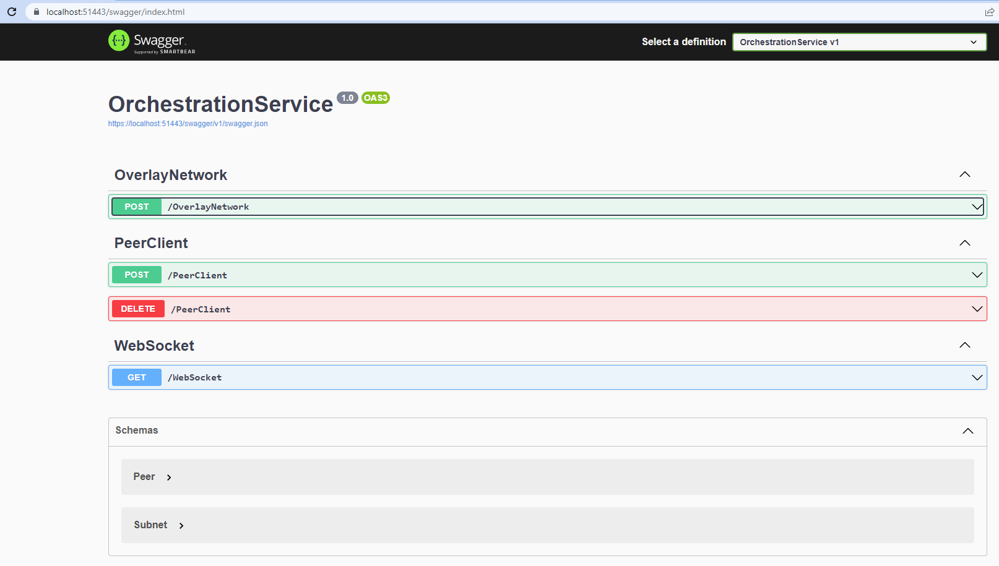
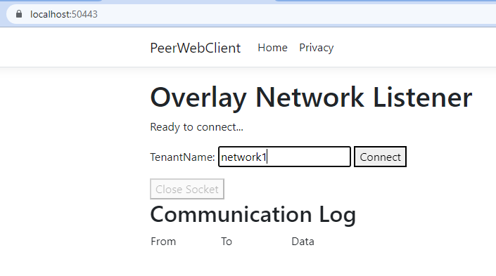

# Orchestration Service
This service is in charge of managing subnets, allocating and deallocating private ips.

# Infra
The service is based on Net 6.0 and written in C#. It is running on top of linux containers, and can be deployed easily through docker.
The following Apis were created:
1. OverlayNetwork - to create subnets.
1. To manage Peers - Create (assigns a new private ip) & Delete
1. WebSocket - for registering to broadcasts in the network ("new peer has joined with public key XXX and private ip YYY")

# TODOs
There's a lot more to be done in the service, add better logging, support distributed systems, caching & optimizations. More tests are also needed.

# How to use
Run the service by running the docker compose project.
1. To use the Api, one can use the swagger [UI](https://localhost:51443/swagger/index.html)

1. I've added a (very) simple [web](https://localhost:50443) client for easier usability of the broad casts & Websockets.

